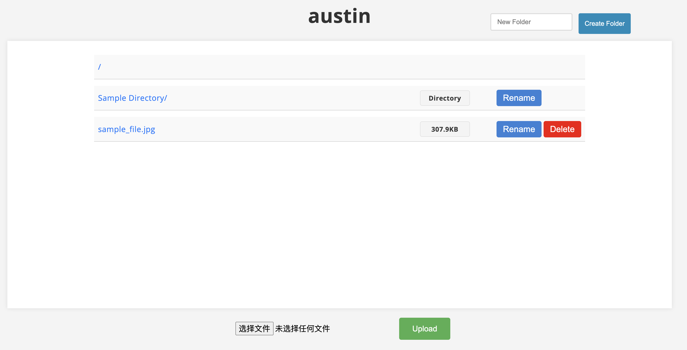

<center><h1>Simple HTTP Server</h1></center>

## Introduction

This is a project in SUSTech CS305. We implement a simple but robust HTTP server written in python without using socketserver http and other modules related to the core of http server.

The server provide cloud storage service with following features:
- **Register** and **login** user with user-password or cookie.
- **View**, **upload** and **download** files. Also supports to rename file and create directory.
- Simple but **beautiful** and **easy-to-use** UI.
- Support chunk transfer and range transfer.
- Store your user data in sqlite database.
- Automatically log.
- Custom **encryption process** by rsa and aes.
- Safe server service with permission control.
- ...

For more features, try it out!


## Install

```cmd
conda create -n simple-http-server python pip
conda activate simple-http-server
pip install cryptography
pip install pytz
pip install jinja2
pip install sqlite3
```
## Run

```cmd
python server.py
```

For advanced usage:
```cmd
python server.py -h
```

```cmd
usage: server.py [-h] [-i IP] [-p PORT] [--parallel PARALLEL] [-t TIMEOUT] [-c COOKIE_PERSIST_TIME] [-d DEBUG]
                 [-s SERVER]

options:
  -h, --help            show this help message and exit
  -i IP, --ip IP        Server IP address
  -p PORT, --port PORT  Server port number
  --parallel PARALLEL   Number of parallel connections
  -t TIMEOUT, --timeout TIMEOUT
                        Timeout seconds for keep-alive connections
  -c COOKIE_PERSIST_TIME, --cookie-persist-time COOKIE_PERSIST_TIME
                        Cookie persist time in seconds
  -d DEBUG, --debug DEBUG
                        Debug mode
  -s SERVER, --server SERVER
                        Server name
```

## Demo




